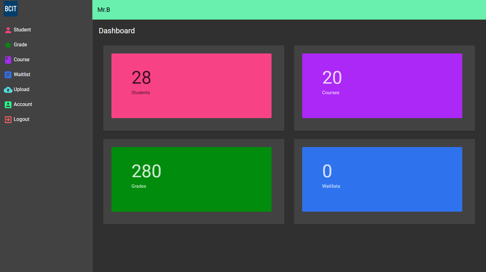

<!-- PROJECT SHIELDS -->
[![Build Status][build-shield]]()
[![Contributors][contributors-shield]]()
[![MIT License][license-shield]][license-url]


<!-- PROJECT LOGO -->
<br />
<p align="center">
  <a href="https://github.com/tommyyeh0505/Automated-Course-Registration-System">
    
  </a>

  <h1 align="center">Automated Course Registration System</h1>

  <p align="center">
   Created by Team M.E.A.T
    <br />
    <a href="https://github.com/othneildrew/Best-README-Template/issues">Report Bug</a>
    ·
    <a href="https://github.com/othneildrew/Best-README-Template/issues">Request Feature</a>
  </p>
</p>


<!-- TABLE OF CONTENTS -->
## Table of Contents

* [About the Project](#about-the-project)
  * [Built With](#built-with)
* [Contributors](#contributors)
* [Getting Started](#getting-started)
  * [Prerequisites](#prerequisites)
  * [Installation](#installation)
* [Usage](#usage)
* [Contributing](#contributing)
* [License](#license)
* [Contact](#contact)
* [API Endpoints](#api-endpoints)


<!-- ABOUT THE PROJECT -->
## About The Project



The BCIT Interior Design Department currently has to manually enter all part-time student grades for each course every term which costed a significant amount of time compiling data in order to check if applicants have the correct prerequisites for each course. This process is very repetitive and inefficient, therefore, they want a system that can compile all the data from all attendance sheets generated from the Cognos system into a more user-friendly format. 

Automated Course Registration System is a proposed web application which contains two parts: the Front-end and Back-end with a goal to reduce the number of manual student grade entries which helps simplify the course registration process and minimize any potential mistakes from manual entries.


### Built With
Technologies used:
* [Angular](https://angular.io/)
* [.Net Core Framework](https://dotnet.microsoft.com/)
* [SQLite](https://www.sqlite.org/index.html)
* [Angular Material](https://material.angular.io/)

## Contributors
* <a href="https://github.com/mikah13">[M]ike Hoang</a>
* <a href="https://github.com/EvaAusa">[E]va Au</a>
* <a href="https://github.com/aght">[A]ndy Tang</a>
* <a href="https://github.com/tommyyeh0505">[T]ommy Yeh</a>


<!-- GETTING STARTED -->
## Getting Started

Please follow these simple steps to get a running version on your local machine

### Prerequisites

You will need to install these packages in order to get the application running
* angular/cli
```sh
npm install @angular/cli
```
* dotnet

### Installation

1. Clone the repo
```sh
git clone https://github.com/tommyyeh0505/Automated-Course-Registration-System
```
2. Navigate to ClientApp folder
```sh
cd ClientApp
```
3. Install NPM packages
```sh
npm install
```
4. Run the Front-end, the website will be running on [localhost:4200](http://localhost:4200/)
```sh
ng serve
```
or
```sh
npm start
```
4. From the root folder, navigate to API/ACRS folder
```sh
cd API/ACRS
```
5. Run the Back-end by executing this command
```sh
dotnet run
```

<!-- CONTRIBUTING -->
## Contributing

Contributions are what make the open source community such an amazing place to be learn, inspire, and create. Any contributions you make are **greatly appreciated**.

1. Fork the Project
2. Create your Feature Branch (`git checkout -b feature/AmazingFeature`)
3. Commit your Changes (`git commit -m 'Add some AmazingFeature`)
4. Push to the Branch (`git push origin feature/AmazingFeature`)
5. Open a Pull Request


<!-- LICENSE -->
## License

Distributed under the MIT License. See `LICENSE` for more information.


<!-- CONTACT -->
## Contact

Eva Au - eva.apy@gmail.com

Tommy Yeh - tommyyeh0505@hotmail.com 

Andy Tang - andytang43@gmail.com 

Mike Hoang - mikehoang.bcit@gmail.com

Project Link: [ACRS](https://github.com/tommyyeh0505/Automated-Course-Registration-System)


## API Endpoints
| URL                                        | Method | Data Params                                                     | URL Params          |
|--------------------------------------------|--------|-----------------------------------------------------------------|---------------------|
| /api/auth/login                            | POST   | `{username, password}`                                            | None                |
| /api/auth/register                         | POST   | `{username, password}`                                            | None                |
| /api/auth/users/:username                  | PUT    | `{username, currentPassword, newPassword}`                        | username            |
| /api/courses                               | GET    | None                                                            | None                |
| /api/courses/:courseId                     | GET    | None                                                            | courseId            |
| /api/courses/:courseId                     | PUT    | `{courseId, passingGrade, prerequisites}`                         | courseId            |
| /api/courses                               | POST   | `{courseId, passingGrade, prerequisites}`                         | None                |
| /api/courses/:courseId                     | DELETE | None                                                            | courseId            |
| /api/courses/:courseId/eligible            | GET    | None                                                            | courseId            |
| /api/courses/:courseId/ineligible          | GET    | None                                                            | courseId            |
| /api/grades                                | GET    | None                                                            | None                |
| /api/grades/:gradeId                       | GET    | None                                                            | gradeId             |
| /api/grades/filter/:courseId/:crn/:term    | GET    | None                                                            | courseId, crn, term |
| /api/grades/:gradeId                       | PUT    | `{gradeId, studentId, courseId, crn, term, finalGrade, attempts}` | gradeId             |
| /api/grades/                               | POST   | `{studentId, courseId, crn, term, finalGrade, attempts}`          | None                |
| /api/grades/:gradeId                       | DELETE | None                                                            | None                |
| /api/students                              | GET    | None                                                            | None                |
| /api/students/:studentId                   | GET    | None                                                            | studentId           |
| /api/students/:studentId                   | PUT    | `{studentId, studentName}`                                        | studentId           |
| /api/students                              | POST   | `{studentId, studentName}`                                        | studentId           |
| /api/students/:studentId                   | DELETE | None                                                            | studentId           |
| /api/waitlists                             | GET    | None                                                            | None                |
| /api/waitlists/:waitlistId                 | GET    | None                                                            | waitlistId          |
| /api/waitlists/                            | POST   | `{courseId, crn, term, studentId}`                                | None                |
| /api/waitlists/:waitlistId                 | DELETE | None                                                            | None                |
| /api/waitlists/filter/:courseId/:crn/:term | GET    | None                                                            | courseId, crn, term |
| /api/waitlists/all                         | DELETE | None                                                            | None                |


<!-- MARKDOWN LINKS & IMAGES -->
[build-shield]: https://img.shields.io/badge/build-passing-brightgreen.svg?style=flat-square
[contributors-shield]: https://img.shields.io/badge/contributors-1-orange.svg?style=flat-square
[license-shield]: https://img.shields.io/badge/license-MIT-blue.svg?style=flat-square
[license-url]: https://github.com/tommyyeh0505/Automated-Course-Registration-System/blob/master/LICENSE
